<p align="center">
  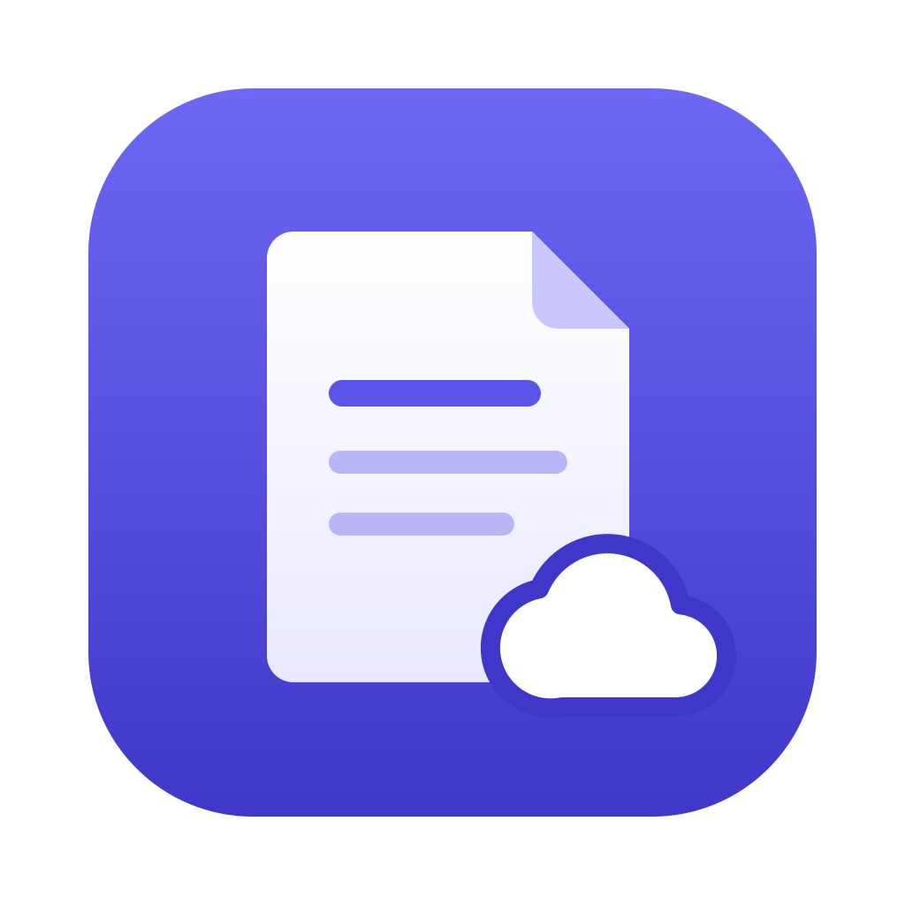
</p>

<h1 align="center">Satchel</h1>

<p align="center">
  <strong>Local-first notes that sync through the iCloud Drive or Google Drive you already have.</strong><br>
  Plain Markdown files, offline semantic search, and an MCP server for Claude Code and Codex.
</p>

<p align="center">
  <a href="https://github.com/REllwood/Satchel/actions/workflows/ci.yml"></a>
  <a href="LICENSE"></a>
  
</p>

<p align="center">
  <a href="#install">Install</a> ·
  <a href="#how-sync-works">How sync works</a> ·
  <a href="#features">Features</a> ·
  <a href="#use-it-with-claude-code-and-codex">Claude Code &amp; Codex</a> ·
  <a href="#development">Development</a>
</p>

<picture>
  <source media="(prefers-color-scheme: dark)" srcset=".github/assets/hero-dark.png">
  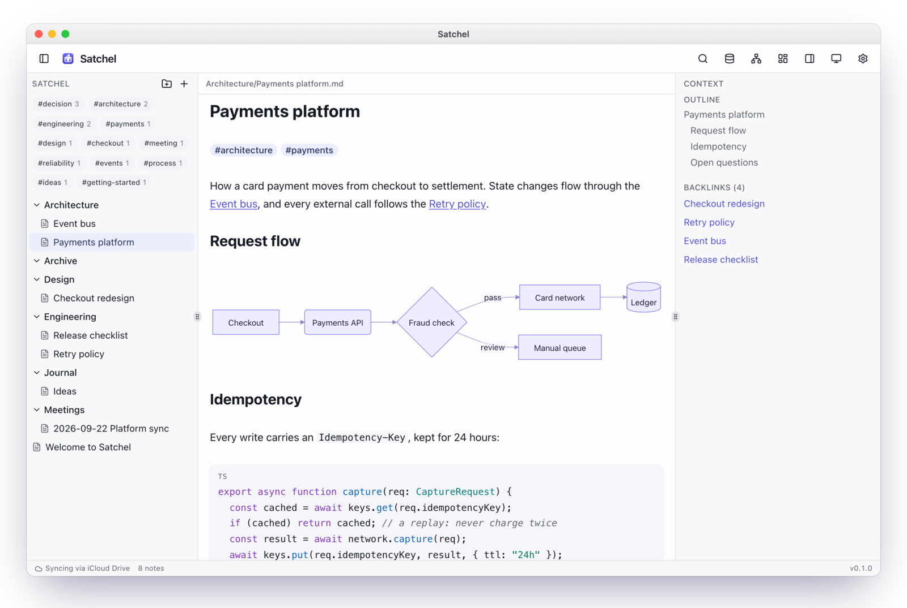
</picture>

## Why Satchel

- **Syncs through your own cloud.** Notes live in a folder in iCloud Drive, Google Drive, Dropbox or
  OneDrive, and that service syncs them to your other devices. Satchel has no server, no account and no
  telemetry.
- **Plain files.** Every note is a `.md` file. Open it in any editor, search it with `grep`, back it up,
  or leave Satchel whenever you like.
- **Code, diagrams and designs in one place.** Write code blocks and Mermaid diagrams, paste in images,
  embed Figma frames, lay notes out on canvases, and query your notes with read-only SQL.
- **Claude Code and Codex can use it.** They search, read and write your notes over MCP, on your
  machine.

## How sync works

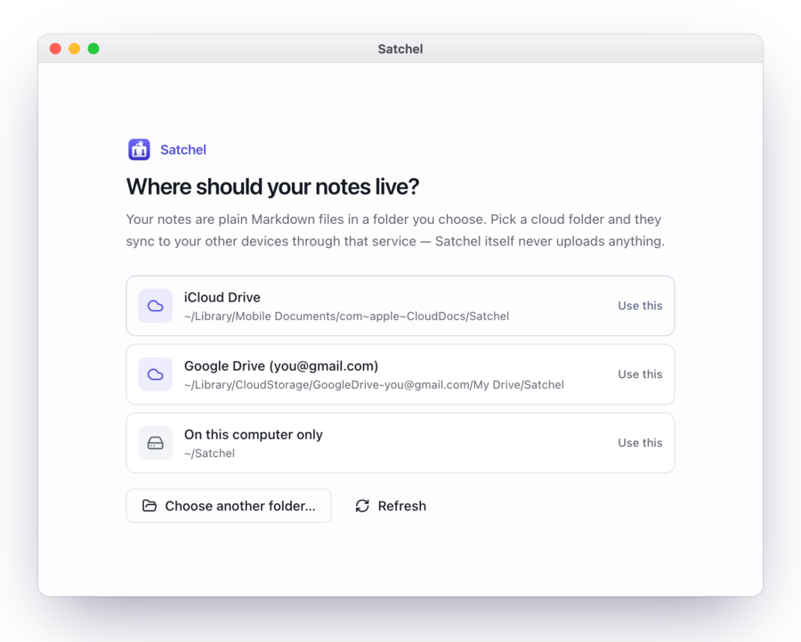

On first launch Satchel finds the sync folders already on your computer and asks where your notes
should live. Pick one and it creates a `Satchel` folder there. The provider's own app does the syncing.

| Service | Where your notes go (macOS) |
|---|---|
| iCloud Drive | `~/Library/Mobile Documents/com~apple~CloudDocs/Satchel` |
| Google Drive | `~/Library/CloudStorage/GoogleDrive-<you>/My Drive/Satchel` |
| Dropbox / OneDrive / Box | `~/Library/CloudStorage/<service>/Satchel` |
| This computer only | `~/Satchel` |

On Windows it finds `iCloudDrive`, `G:\My Drive`, Dropbox and OneDrive the same way. You can also pick
any other folder, then change it later in **Settings → Notes location**.

<br clear="right">

<p align="center">
  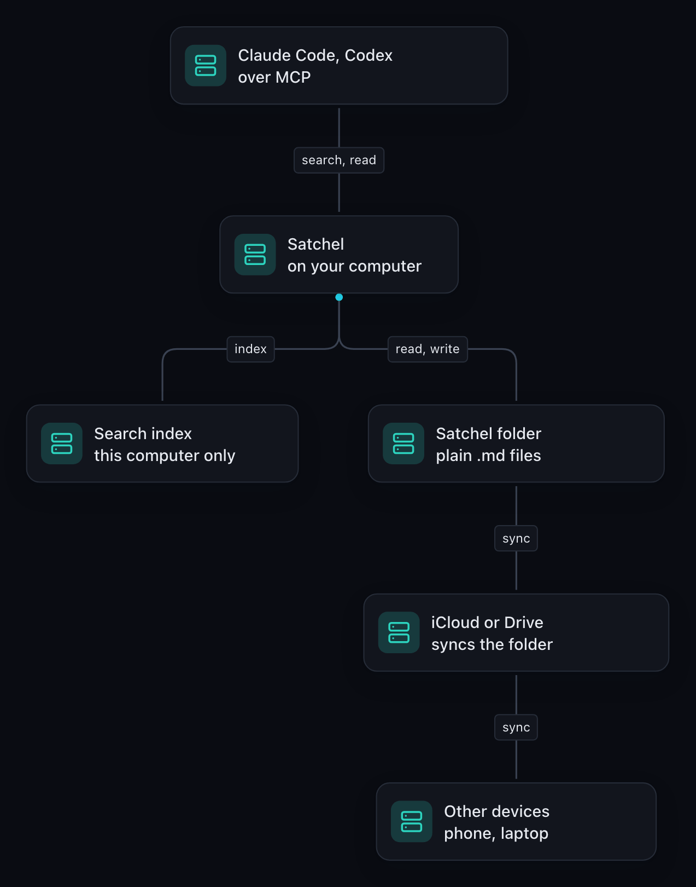
  <br>
  <sub>Diagram made with <a href="https://www.gravelgraph.com">GravelGraph</a></sub>
</p>

- **Google Drive** needs [Google Drive for desktop](https://www.google.com/drive/download/). Sign in and
  the folder appears in Satchel. **iCloud Drive** needs to be on in System Settings → Apple Account → iCloud.
- The search index stays on each computer, in the app-data folder, never in your notes folder. Only
  notes and attachments sync, so two computers never write to the same database file.
- Cloud-only files (from "Optimize Mac Storage" or Google Drive streaming) stay in the cloud until you
  open them, so Satchel never downloads your whole library at startup. Notes it has already indexed stay
  searchable. For full offline search, mark the folder **Keep Downloaded** (iCloud) or
  **Available offline** (Google Drive).
- If a note changes on another device while you're editing it, Satchel keeps your edits and saves the
  other version next to it. Deleting a note or folder moves it to the system Trash.

## Features

### Write with live preview

As in Obsidian, Markdown syntax hides once your cursor leaves a line, so headings, bold text, `[[links]]`
(with autocomplete), `#tags`, checklists and highlighted code look finished while you write. A Mermaid
block renders as a diagram when you close it.

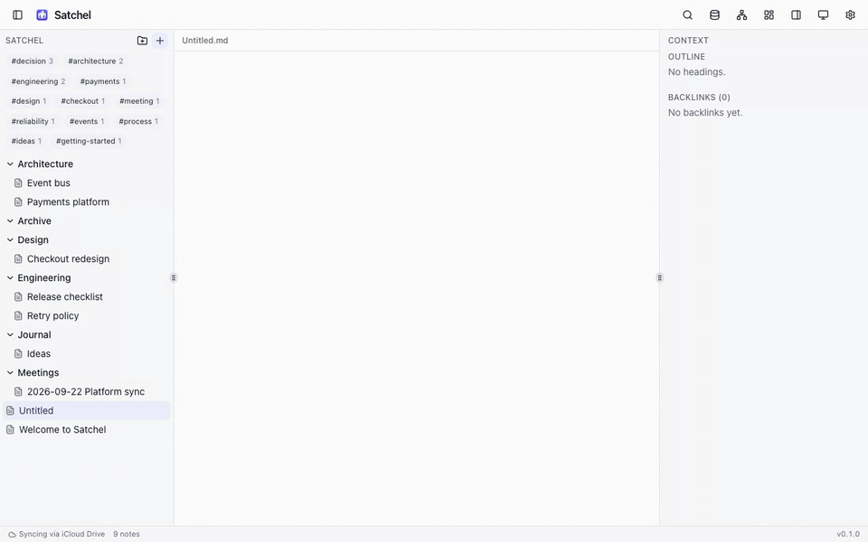

### Search by keyword or by meaning

Press <kbd>⌘</kbd> <kbd>K</kbd>. Full-text search runs on SQLite FTS5. Semantic search matches a question
like *"how do we avoid charging a card twice?"* to the notes that answer it, using an embedding model
that ships with the app and runs offline. Hybrid mode combines the two.

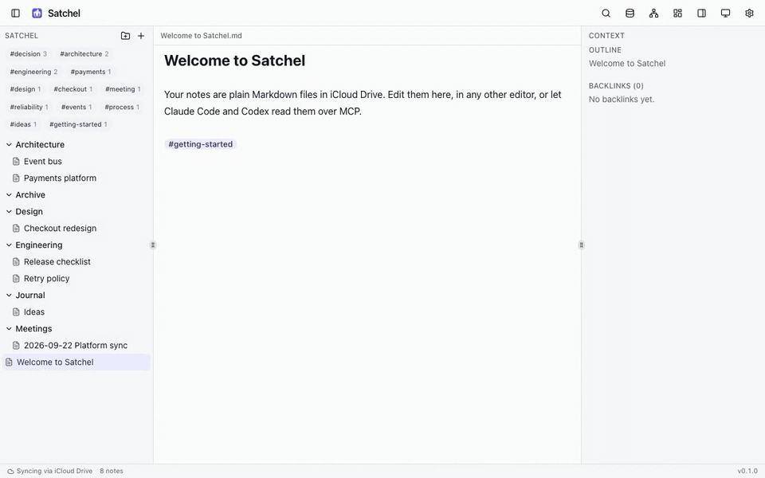

### See how your notes connect

<table>
  <tr>
    <td width="50%">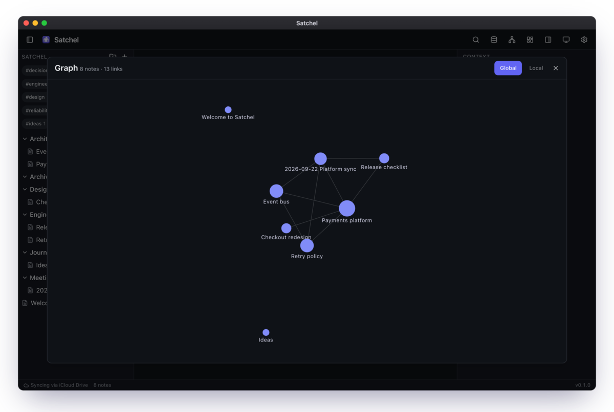</td>
    <td width="50%">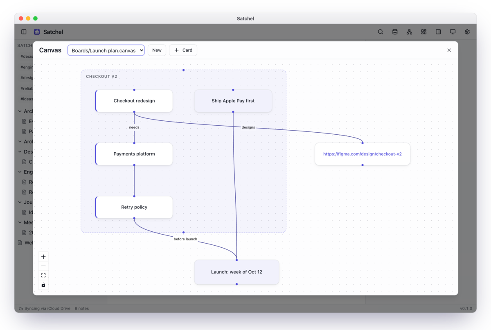</td>
  </tr>
  <tr>
    <td align="center"><b>Graph</b>: every <code>[[link]]</code>, global or around the current note</td>
    <td align="center"><b>Canvas</b>: Obsidian-compatible <a href="https://jsoncanvas.org">JSONCanvas</a> boards</td>
  </tr>
  <tr>
    <td width="50%">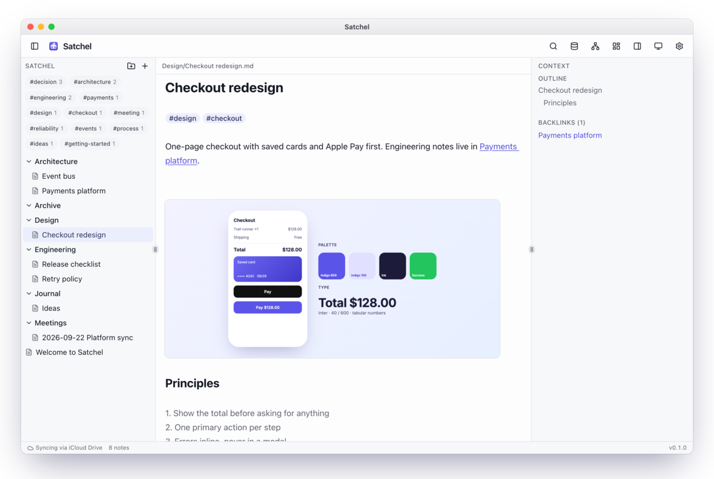</td>
    <td width="50%">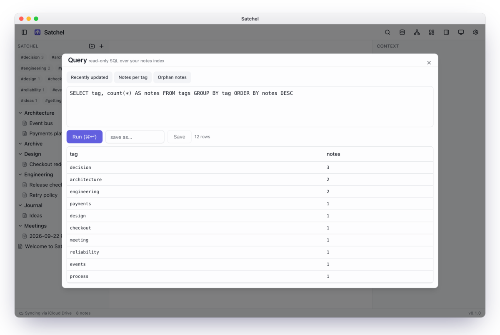</td>
  </tr>
  <tr>
    <td align="center"><b>Images and Figma</b>: paste or drag images in, paste a Figma link to embed it</td>
    <td align="center"><b>Query</b>: read-only SQL over notes, tags and links</td>
  </tr>
</table>

Satchel also has folders (create, rename, and move notes between them), backlinks and an outline in the
side panel, a tag filter, and light and dark themes that follow your OS. Shortcuts: <kbd>⌘</kbd>
<kbd>K</kbd> search, <kbd>⌘</kbd> <kbd>⇧</kbd> <kbd>P</kbd> commands, <kbd>⌘</kbd> <kbd>N</kbd> new note.

## Use it with Claude Code and Codex

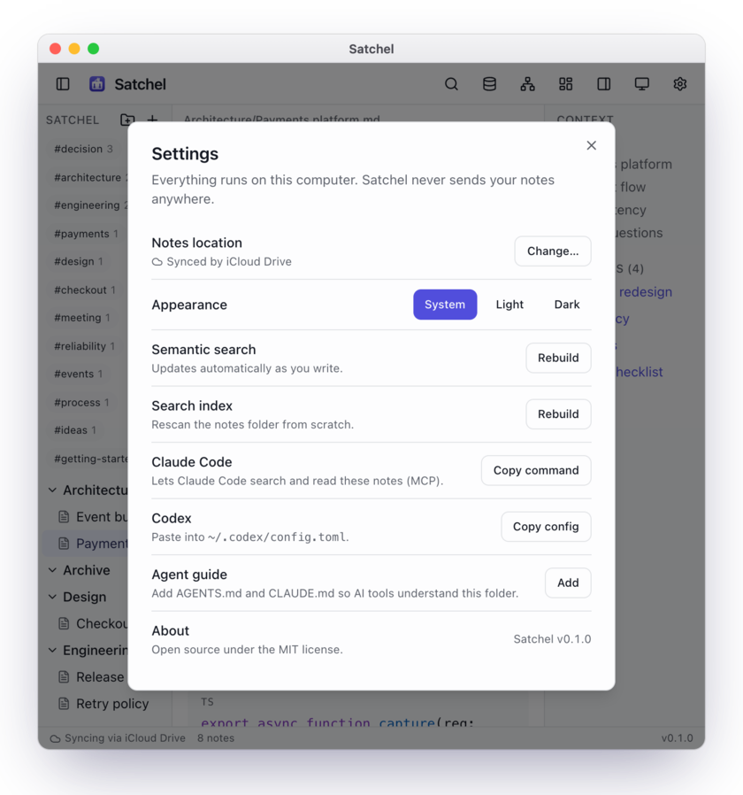

The Satchel app is also an MCP server, with these tools: `search_notes`, `semantic_search`,
`list_notes`, `read_note`, `create_note`, `list_tags` and `run_query` (read-only). You don't need to
install anything else. In **Settings**, the Claude Code and Codex rows copy the exact setup for your
computer.

```bash
claude mcp add --transport stdio satchel -- \
  "/Applications/Satchel.app/Contents/MacOS/satchel-app" mcp --vault "<your notes folder>"
```

For Codex, add this to `~/.codex/config.toml`:

```toml
[mcp_servers.satchel]
command = "/Applications/Satchel.app/Contents/MacOS/satchel-app"
args = ["mcp", "--vault", "<your notes folder>"]
```

**Settings → Agent guide** adds an `AGENTS.md` and a `CLAUDE.md` to your notes folder, which explain
its layout and conventions to coding agents.

<br clear="right">

## Install

Download the latest build from [Releases](https://github.com/REllwood/Satchel/releases):

| Platform | Download |
|---|---|
| macOS 13.4+ (Apple silicon) | `.dmg` |
| Windows 10/11 | `.msi` or `.exe` |
| Linux (glibc 2.38+, e.g. Ubuntu 24.04+) | `.AppImage`, `.deb` or `.rpm` |

Builds aren't notarized by Apple yet, so macOS blocks the first launch. After moving Satchel to
Applications, either open **System Settings → Privacy & Security** and click **Open Anyway**, or run:

```bash
xattr -dr com.apple.quarantine /Applications/Satchel.app
```

### Command-line tool (optional)

```bash
cargo install --path crates/satchel-cli     # installs `satchel`

satchel --vault <folder> search "<query>"   # full-text (--semantic for meaning-based)
satchel --vault <folder> query "SELECT ..." # read-only SQL over the index (--json)
satchel --vault <folder> new "Title"        # create a note
satchel --vault <folder> get note.md        # print a note
satchel --vault <folder> export note.md --html
satchel --vault <folder> mcp                # MCP server over stdio
```

## Your notes folder

```
Satchel/
  **/*.md        notes (Markdown, optional YAML frontmatter)
  attachments/   images and other embedded files
  *.canvas       JSONCanvas boards
  AGENTS.md      conventions for AI tools (optional)
```

Titles come from frontmatter `title:`, else the first `# Heading`, else the file name. Link notes with
`[[Note]]`, `[[Note#Heading]]` or `[[Note|alias]]`; embed images with `![[image.png]]`; tag with
`#tag` or frontmatter `tags: [a, b]`.

## Privacy

Satchel makes no network requests in normal use. The embedding model is bundled with the app. The
only exception is a Figma embed you paste, which loads from Figma. A strict Content-Security-Policy
blocks all other remote content.

## Development

You'll need [Bun](https://bun.sh), stable [Rust](https://rustup.rs), and the
[Tauri prerequisites](https://v2.tauri.app/start/prerequisites/) for your OS.

```bash
bun install
bun run tauri dev          # the desktop app with hot reload
bun run tauri build        # native bundles in target/release/bundle
cargo test --workspace     # Rust core, CLI and MCP tests
bun run test               # frontend tests (Vitest)
```

All the logic lives in one Rust crate, `crates/satchel-core`. It covers vault I/O, parsing, the
SQLite/FTS5 + sqlite-vec index, embeddings and MCP. Three thin layers sit on top of it: the Tauri desktop
app (`src-tauri`, with the React UI in `src`), the `satchel` CLI (`crates/satchel-cli`), and the MCP
server. You can delete the index at any time; Satchel rebuilds it from the files.

Pushing a `v*` tag runs the release workflow, which builds installers for every platform into a draft
GitHub release.

## License

[MIT](LICENSE)
